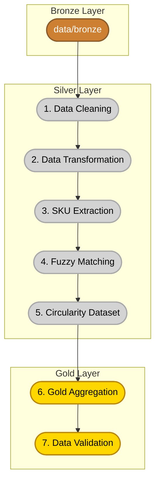

# EchoChain Circular Economy ETL Pipeline

EchoChain is a scalable data engineering and analytics pipeline designed to process and analyze circular economy lifecycle data. The pipeline cleans, processes, maps, and analyzes product circularity and marketplace resale listings, preparing structured outputs for downstream Business Intelligence (BI) tools like Power BI.

---

## Pipeline Architecture

The ETL pipeline consists of a **7-stage sequential architecture** running from raw Bronze data to aggregated Gold metrics:



---

## Repository Structure

```text
echochain-circular-economy/
├── configs/
│   └── spark_config.py         # Configures SparkSession (with RawLocalFileSystem Windows workarounds)
├── data/
│   ├── bronze/                 # Raw production input files (50,000+ rows)
│   │   ├── SKU_Master_final.csv
│   │   ├── clean_scraper_data.csv
│   │   ├── warrant_details_final.csv
│   │   ├── BOM_details_updated.csv
│   │   └── circularity_score_final.csv
│   ├── silver/                 # Intermediate cleaned and type-casted datasets
│   ├── processed/              # Joined and enriched datasets
│   └── gold/                   # Aggregated business metric directories
├── docs/                       # Daily progress, workflow, and system setup documentation
├── pyspark/                    # Main processing ETL step scripts (Stages 1-7)
│   ├── data_cleaning.py
│   ├── transformation.py
│   ├── sku_extraction.py
│   ├── fuzzy_matching.py
│   ├── circularity_dataset.py
│   ├── aggregate_listings.py
│   └── validate_transformed.py
├── tests/                      # Testing architecture
│   ├── mock_data/              # Isolated, lightweight mock data for QA tests (100 rows each)
│   ├── test_transformation.py
│   ├── test_matching.py
│   └── test_aggregation.py
├── run_pipeline.py             # Main entrypoint runner for execution of the entire ETL pipeline
├── requirements.txt            # System dependencies (PySpark, DuckDB, Pandas, etc.)
└── README.md
```

---

## Windows Environment & Serialization
To execute PySpark seamlessly in local Windows environments without triggering PyArrow DLL load blocks or missing `winutils.exe` Hadoop errors, this project features:
1. **RawLocalFileSystem Override:** Configured in `configs/spark_config.py` to bypass Hadoop-specific directory locking.
2. **DuckDB Serialization Engine:** Used to read and output Parquet records reliably, providing high performance and eliminating PyArrow dependency errors.

---

## Quick Start

### 1. Installation
Clone the repository and install the dependencies in a virtual environment:
```bash
# Activate your virtual environment (.venv)
.venv\Scripts\activate

# Install requirements
pip install -r requirements.txt
```

### 2. Run the Full ETL Pipeline
Processes the raw Bronze datasets and writes the completed Gold metrics to disk:
```bash
python run_pipeline.py
```

### 3. Run Unit Tests (QA)
Validates the data transformation and matching logic against localized mock datasets:
```bash
python -m unittest tests/test_transformation.py
python -m unittest tests/test_matching.py
python -m unittest tests/test_aggregation.py
```
