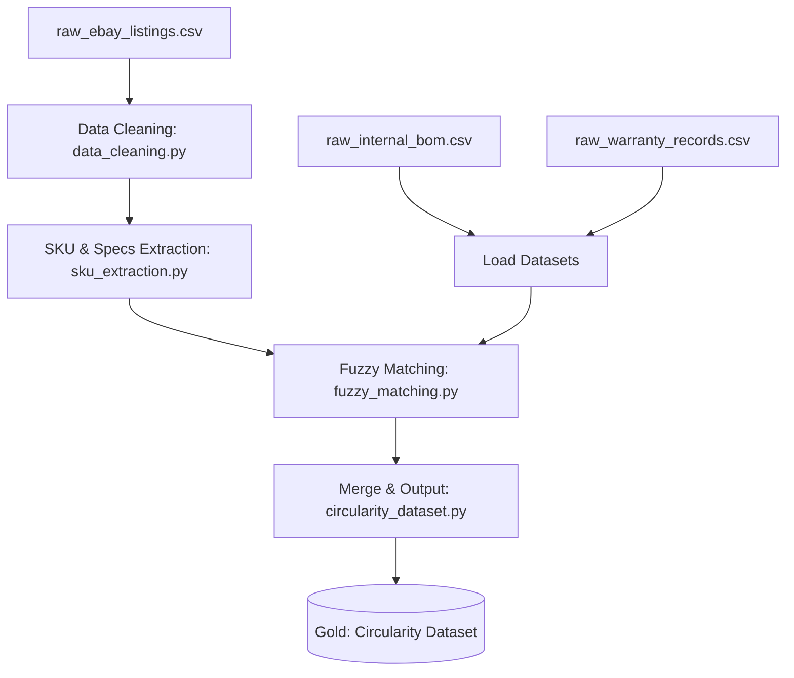

# EchoChain: PySpark Data Engineering Workflow

This document details the data pipeline architecture, schema specifications, and ETL stages managed by the **PySpark Engineer (Member 3)** for Project EchoChain (Circular Economy & Secondary Market Lifecycle Analytics).

---

## 1. Pipeline Overview
The EchoChain data pipeline processes messy, unstructured secondary market data (scraped eBay electronics listings) and combines it with internal corporate manufacturing data (Bills of Materials and warranty logs). 

This unified data helps identify component failure rates and product resale values, pointing to optimal buy-back and refurbishment opportunities.

---

## 2. Input Datasets (Bronze Layer)

### A. Scraped eBay Listings (`raw_ebay_listings.csv`)
Unstructured listings scraped from secondary marketplaces.
- `listing_id` (String): Unique identifier.
- `title` (String): Messy product listing title (e.g. *"GENTLY USED Thinkpad t-490 laptop 16gb"*).
- `price` (String): Resale price text (e.g. *"$320.00"*).
- `item_condition` (String): Item state (e.g. *Used*, *Parts only*).
- `scrape_date` (String): Date of collection.

### B. Internal Bill of Materials (`raw_internal_bom.csv`)
Pristine internal corporate database of manufactured parts.
- `model_id` (String): Unique model identifier.
- `model_name` (String): Official retail model name (e.g. *ThinkPad T490*).
- `brand` (String): Manufacturer brand name (e.g. *Lenovo*).
- `component` (String): Internal component name (e.g. *Motherboard*, *Display Panel*).
- `original_retail_price` (Double): Original price at launch.

### C. Warranty & Failure Logs (`raw_warranty_records.csv`)
Logs of return/failure claims for manufactured hardware.
- `record_id` (String): Unique claim record.
- `model_id` (String): Internal model identifier.
- `component_failed` (String): Name of the component that failed.
- `failure_age_months` (Integer): Lifespan of the component before failure.

---

## 3. PySpark ETL Stages

### Stage 1: Data Cleaning (`data_cleaning.py`)
- **Null Handling**: Remove rows with null identifiers or invalid listing records.
- **Casing & Trimming**: Standardize text columns to lowercase and trim extra whitespaces.
- **Price Extraction**: Clean price text fields by removing currency symbols and casting to Double (e.g., `"$1,200.00"` -> `1200.00`).

### Stage 2: SKU Extraction (`sku_extraction.py`)
- Extract laptop brands (e.g. `Lenovo`, `Dell`, `Apple`) and model codes (e.g. `T490`, `9500`, `M1`) from messy scraped titles using PySpark SQL regular expression functions.
- Extract attributes like memory size (e.g. `16GB RAM`) and storage size (e.g. `512GB SSD`).

### Stage 3: Fuzzy Matching (`fuzzy_matching.py`)
- Map the extracted messy models against the pristine list of internal BOM model names.
- Use PySpark's SQL `levenshtein` distance function to join the datasets (e.g., matching `"dell xps15"` with `"XPS 15 9500"`).
- Select the match with the minimum Levenshtein distance under a threshold of $\le 3$.

### Stage 4: Circularity Dataset Generation (`circularity_dataset.py`)
- Merge the cleaned, matched marketplace listings with the internal BOM (specifying original prices) and the warranty records (specifying component lifespan failures).
- Output a unified table containing all joined fields (the **Circularity Dataset**) into the Gold Layer.

---

## 4. Pipeline Outputs
The processed data is exported to the target directory:
- **`data/processed/circularity_dataset/`**: The final merged, parquet-formatted table ready for the BI Engineer to import and use for DAX calculations in Power BI.
