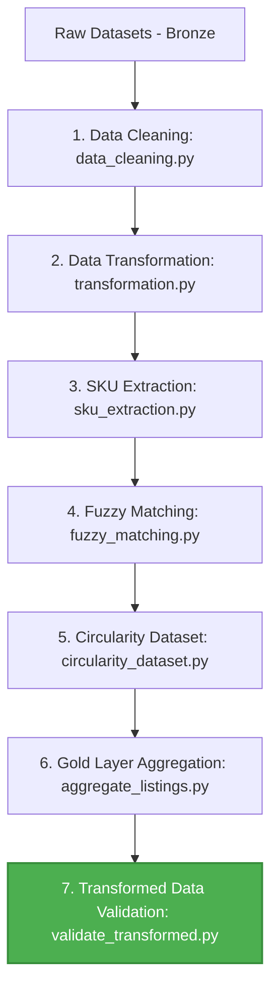

# EchoChain: PySpark Data Engineering Workflow

This document details the data pipeline architecture, schema specifications, and ETL stages managed by the **PySpark Engineer (Member 3)** for Project EchoChain (Circular Economy & Secondary Market Lifecycle Analytics).

---

## 1. Pipeline Overview
The EchoChain data pipeline processes messy, unstructured secondary market listings (scraped electronics data) and combines it with internal corporate manufacturing data (Bills of Materials, warranty logs, SKU Master registers, and circularity scores).

This unified data helps identify component failure rates and product resale values, pointing to optimal buy-back, refurbishment, and waste reduction opportunities.

```mermaid
graph TD
    A[Raw Datasets - Bronze] --> B[1. Data Cleaning: data_cleaning.py]
    B --> C[2. Data Transformation: transformation.py]
    C --> D[3. SKU Extraction: sku_extraction.py]
    D --> E[4. Fuzzy Matching: fuzzy_matching.py]
    E --> F[5. Circularity Dataset: circularity_dataset.py]
    F --> G[6. Gold Layer Aggregation: aggregate_listings.py]
    G --> H[7. Transformed Data Validation: validate_transformed.py]
    
    style H fill:#4CAF50,stroke:#388E3C,stroke-width:2px,color:#fff
```

---

## 2. Input Datasets (Bronze Layer)

### A. Scraped Marketplace Listings (`scraper_data.csv`)
Unstructured listings scraped from secondary marketplaces.
- `product_id` (Double): Unique listing identifier.
- `product_name` (String): Messy product listing title (e.g., *"GENTLY USED Thinkpad t-490 laptop 16gb"*).
- `resale_price` (Double): Cleaned resale price value.
- `condition` (String): Product cosmetic state (e.g., *Refurbished*, *used*).

### B. Internal Bill of Materials (`BOM_details.csv`)
Corporate database listing weights, material classifications, and components.
- `bom_id` (String): Unique BOM entry identifier.
- `sku_id` (String): Unique stock keeping unit.
- `component_name` (String): Component identifier (e.g., *battery*, *display*).
- `recyclable` (String): Recycle compatibility flag (`yes`/`no`).
- `cost_per_component` (Double): Manufacturing cost of component.

### C. Warranty & Return Claims (`warrant_details.csv`)
Historical logs tracking manufacturer warranty claims.
- `warranty_id` (String): Unique identifier.
- `sku_id` (String): Linked product model SKU.
- `warranty_period_months` (Integer): Length of coverage.
- `claim_status` (String): Claims processing details.

### D. SKU Master Register (`SKU_Master.csv`)
Canonical catalogue containing hardware details.
- `sku_id` (String): Unique product model SKU code.
- `product_name` (String): Official retail model name.
- `brand` (String): Hardware brand name.
- `expected_life_span` (Integer): Model design life duration.
- `repairability_score` (Double): Product repair score rating (0–10).

### E. Circularity Score Index (`circularity_score.csv`)
Reference dataset describing device recyclability and reusability indices.
- `product_id` (Double): Linked listing identifier.
- `sku_id` (String): Unique SKU lookup.
- `recyclability_score` (Double): Recycled potential score.
- `overall_circularity_score` (Double): Circularity score metric (0–100).

---

## 3. PySpark ETL Stages

### Stage 1: Data Cleaning (`data_cleaning.py`)
* **Null Handling**: Verify and remove rows with missing identifiers.
* **Standardization**: Convert text fields to lowercase and strip excess spaces.
* **Format Aligning**: Save standardized outputs to the Silver Layer (`data/silver/`).

### Stage 2: Data Transformation (`transformation.py`)
* **Type Casting**: Enforce correct schemas (e.g., casting IDs to Double, dates to Strings, flags to Booleans).
* **Column Formatting**: Clean values of logical fields (e.g. converting `yes`/`no` flags to clean flags).

### Stage 3: SKU & Specs Extraction (`sku_extraction.py`)
* **Regex Extraction**: Parse scraped listing titles using regular expressions to extract device components: Brand (e.g., `hp`, `apple`) and Model Code (e.g., `t490`, `macbook`).

### Stage 4: Fuzzy Matching (`fuzzy_matching.py`)
* **Fuzzy Joins**: Map extracted messy marketplace model names against the pristine SKU Master catalogue.
* **Distance Sorting**: Standardize matching results utilizing Levenshtein distance calculations to find the closest official SKU match.

### Stage 5: Circularity Dataset (`circularity_dataset.py`)
* **Multi-Layer Merge**: Join matched listings with bill of materials details, warranties, and circularity indices on `sku_id` and `product_id`.
* **Output Compilation**: Export the complete 50,000-record dataset in both CSV and Parquet formats.

### Stage 6: Gold Layer Aggregation (`aggregate_listings.py`)
* **Metrics Reduction**: Reduce the 50,000 merged records to a compact 280-record performance matrix grouped by brand and product type.
* **Financial Calculations**: Calculate circularity averages, warranty claims, scrap costs, resale ratios, and refurbishment margins.

### Stage 7: Transformed Data Validation (`validate_transformed.py`)
* **Data Quality Assertions**: Test schemas, row counts, ranges, null rates, and primary key uniqueness across exported layers.

---

## 4. Pipeline Outputs

The pipeline populates the following processed stores during execution:
* 📂 **`data/processed/circularity_dataset/part-0.parquet`**: Columnar dataset holding the complete circularity metrics.
* 📄 **`data/processed/circularity_dataset.csv`**: Universal CSV version of the Circularity Dataset.
* 📄 **`data/gold/aggregated_product_data.csv`**: Compact 280-row product matrix targeting refurbishment yields and BI reports.

---

## 🛡️ Windows Environment Architecture Workaround
To ensure complete local execution compatibility:
* Local Application Control restrictions block execution of `pyarrow` compiled DLL packages.
* Native JVM Parquet writes fail on Windows when `winutils.exe` is absent.
* **The Solution**: DuckDB. The pipeline runs Spark operations under pure-Python structures, uses a fallback non-Arrow serializer to obtain a Pandas database in memory, and writes output files utilizing `duckdb`'s native execution engine (`duckdb.execute("COPY pandas_df TO 'part-0.parquet'...")`).
* **Validation**: The validation script parses output parquet structures without PyArrow overhead through DuckDB's in-memory reader.
